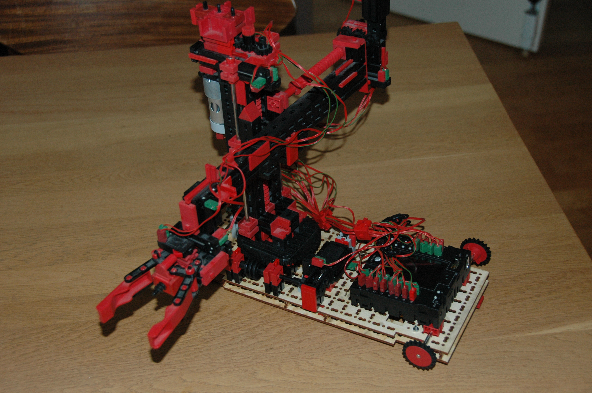
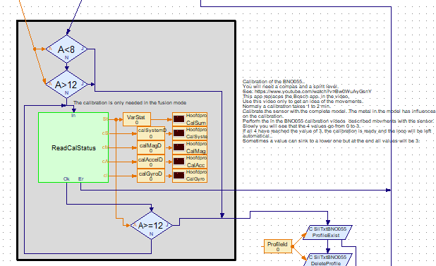
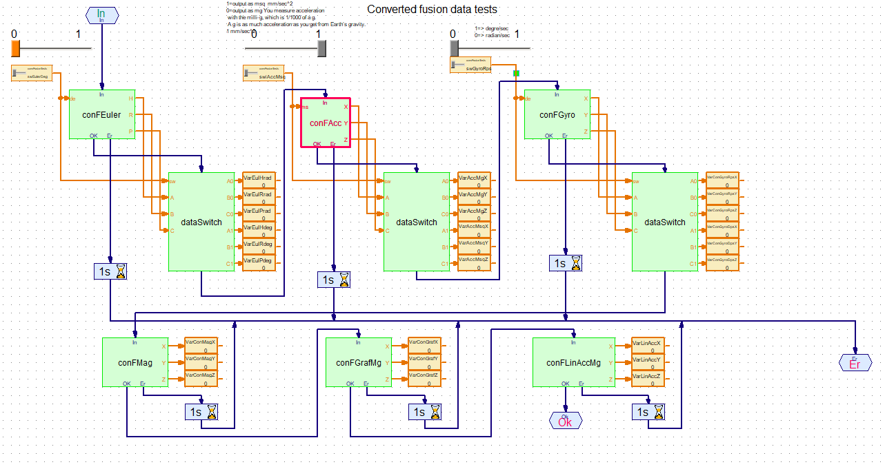
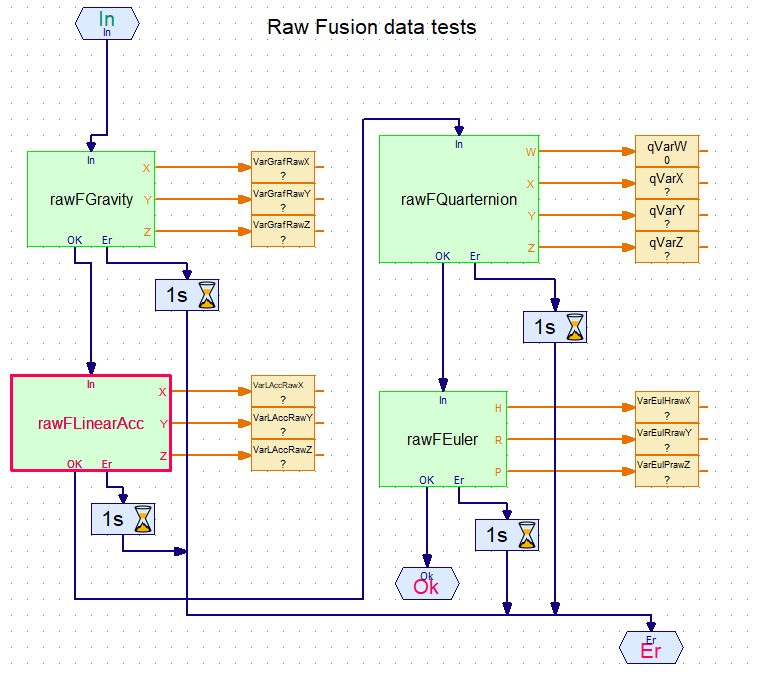

# Content
<!-- TOC depthFrom:1 depthTo:6 withLinks:1 updateOnSave:1 orderedList:0 -->

- [Content](#content)
- [Examples for the end-user](#examples-for-the-end-user)
	- [What are these maps about?](#what-are-these-maps-about)
		- [For a SLI:](#for-a-sli)
		- [For the local executable](#for-the-local-executable)
	- [How to install?](#how-to-install)
	- [How to get and to inspect the trace log?<a id="howtracelog"></a>](#how-to-get-and-to-inspect-the-trace-loga-idhowtraceloga)
	- [Overview examples](#overview-examples)
		- [example 1: SLI_TxtSliSave4C](#example-1-slitxtslisave4c)
		- [example 2: SLI_TeachIn](#example-2-sliteachin)
			- [Panel player](#panel-player)
			- [Panel TeachIn](#panel-teachin)
		- [example 3: SLI_Bosch_BNO055](#example-3-sliboschbno055)
- [document history](#document-history)

<!-- /TOC -->
[Back to main content overview](https://github.com/fischertechnik/txt_demo_ROBOPro_SLI/blob/master/README.md#overview)
# Examples for the end-user

In the section you will find pre-compiled examples.<br/>
The latest 'FtTxtExamples' section is available for downloading as .zip under the menu item [`releases`](https://github.com/fischertechnik/txt_demo_ROBOPro_SLI/releases)<br/>
After downloading you can unzip the file and use the pre-compiled SLI shared libraries and the RoboPro "start with" examples.
So you don't need Git experiences to use the files. 

## What are these maps about?
### For a SLI:
The project maps contains at least:
- `libs` map: The shared libraries, compiled C/C++ file(s) 
- `RoboPro` map: One or more RoboPro programs, which shows how to use this SLI
- `root`: Documentation about the functionality of this SLI  |   |  

### For the local executable
The project maps contains at least:
- `C-Program` map: The executables, compiled C/C++ file(s).
- `root`:  Documentation about the functionality of this executable.

## How to install?
> Remark: You need a fischertechnik TXT controller with firmware 4.6.6 or 4.7.0.<br/>
The TXT can also boot from SD-card, see here for [the instructions](https://www.fischertechnik.de/-/media/fischertechnik/fite/service/downloads/robotics/txt-controller/documents/txt_-firmware_microsd.ashx) and here for [the firmware versions](https://github.com/fischertechnik/FT-TXT/releases).<br/>

The installation of the SLI's and executable can be done with the [TXT web server interface](../HowToUseTxtWeb.md).
The TXT web server interface enables also the maintenance of the public maps on the TXT, including connected USB-memory and SD-card (formatted as FAT32, but not in use as boot device)
- The TXT web server needs to be activated.
- Use your web browser to access the web page
URL= http://<ip-addres of the TXT>
- ID=TXT, password= the actual number of the TXT
- upload the SLI library to the libs map.
- upload the executable to the C-Program map

## How to get and to inspect the trace log?<a id="howtracelog"></a> 
When you are developing a RoboPro application which is using a SLI, it could be useful to consult the trace log.
How to do that?
- Activate your TXT and check the ip-address.
- Copy the SLI to the TXT in `libs` map with FileZilla. [See also:](https://github.com/fischertechnik/txt_demo_ROBOPro_SLI/blob/master/WhichToolsYouNeed.md#filezillasetup) 
- Start a SSH connection with Putty with a screen -r command.<br/>
  Be sure that Putty is writing his log to a file. [See also:](https://github.com/fischertechnik/txt_demo_ROBOPro_SLI/blob/master/WhichToolsYouNeed.md#puttysetup)
- Open this trace log file with Notepad++. [See also:](https://github.com/fischertechnik/txt_demo_ROBOPro_SLI/blob/master/WhichToolsYouNeed.md#notepad)<br/>
  When the trace log become longer, Notepad will ask you for reloading it.<br/>
  With Notepad++ it is easy the search in the trace log file and to inspect the trace log.
- Start the accompanying RoboPro program try to understand wat is in the trace log file.<br/>

This is a typical log entry of a SLI function that has been called from RoboPro.<br/>
```
SharedLibraryInterface_ExecuteReadINT16 libTxtSliSaveTeachIn.so getCoorRShort: ENTRY 0
SharedLibraryInterface_ExecuteReadINT16 lib 0xb3501628
SharedLibraryInterface_ExecuteReadINT16 func 0xb40482fd
***** get CoorR=0
SharedLibraryInterface_ExecuteReadINT16 libTxtSliSaveTeachIn.so getCoorRShort RESULT 0 11 
 ```
Explaination of this entry:<br/>
- `ENTRY 0`  the start of the SLI call with here a input value 0;
- `***** get CoorR=0` a line with information written by the SLI. 
- `RESULT 0 0` end of this SLI call, `0` is the return value and means no error, `11` is the parameter value.
   

## Overview examples
### example 1: SLI_TxtSliSave4C

> [See also the project readme for more detailed information](./SLI_TxtSliSave4C/README.md)

Gives an example of reading/writing set of coordinates to/from the public TXT Data map.

.png)

### example 2: SLI_TeachIn

> [See also the project readme for more detailed information](./SLI_TeachIn/README.md)

- This SLI TeachIn is about the industrial Robot with 4 motors and switches as for the industrial Robot with 2 encoder motors and 2 motor (TX-C set).



- Both the TeachIn RoboPro programs has been extended.
  There is now one extended player for both versions.
- Target controller: fischertechnik TXT
- The libTxtSliSaveTeachIn.so SLI makes it possible to read and to write files with  4D-coordinate set from and to the `/etc/knobloch/Data` (Date area on the TXT)

#### Panel player
.png)

#### Panel TeachIn
.png)


### example 3: SLI_Bosch_BNO055

> [See also the project readme for more detailed information](./SLI_Bosch_BNO055/README.md)
 
(The is a beta release, most of the technical information is in the Bosch BNO005 manual)
This example is about the use of the Bosch [the  Bosch BNO055 sensor](https://www.bosch-sensortec.com/bst/products/all_products/bno055). 
The two RoboPro programs:
1. the calibration (creating one of the 6 internal profiles)



2. the options for the normal operation mode.
- Most of the time the end-user will work in the `Converted fusion mode`



- However the  `Raw fusion mode` will also been showed


 


# document history 
- 2020-05-16/22 CvL 466.1.1 new
- 2020-05-29 CvL 466.1.2 add Robot 3D TeachIn
- 2020-06-01,02 CvL 466.1.3 add BNO005