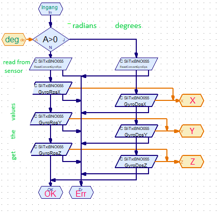

# Content
<!-- TOC depthFrom:1 depthTo:6 withLinks:1 updateOnSave:1 orderedList:0 -->

- [TXT Shared Library Interface (SLI) for using the Bosch BNO055 sensor in RoboPro](#txt-shared-library-interface-sli-for-using-the-bosch-bno055-sensor-in-robopro)
- [Introduction, what is a BNO055?](#introduction-what-is-a-bno055)
	- [The BNO055 sensor documentation](#the-bno055-sensor-documentation)
	- [Introduction in the math behind Quaternions, Euler angle](#introduction-in-the-math-behind-quaternions-euler-angle)
- [Technical data about this SLI](#technical-data-about-this-sli)
	- [Requirements](#requirements)
	- [RoboPro library elements](#robopro-library-elements)
		- [Initialization and calibration elements](#initialization-and-calibration-elements)
		- [Calibration](#calibration)
		- [The "get data" RoboPro elements](#the-get-data-robopro-elements)
			- [Raw data RoboPro elements](#raw-data-robopro-elements)
			- [Raw fusion data RoboPro elements](#raw-fusion-data-robopro-elements)
			- [Converted fusion data RoboPro elements](#converted-fusion-data-robopro-elements)
			- [Test example  RoboPro elements](#test-example-robopro-elements)
	- [Operational modes](#operational-modes)
- [document history](#document-history)

<!-- /TOC -->
# TXT Shared Library Interface (SLI) for using the Bosch BNO055 sensor in RoboPro
# Introduction, what is a BNO055?
 
## The BNO055 sensor documentation
- General information about [the BNO055 sensor](https://www.bosch-sensortec.com/bst/products/all_products/bno055).
[Document overview](https://www.bosch-sensortec.com/products/smart-sensors/bno055.html#documents)
- For detailed information about the BNO055 sensor see also [the BNO055 data sheet]
(https://www.bosch-sensortec.com/media/boschsensortec/downloads/datasheets/bst-bno055-ds000.pdf).

## Introduction in the math behind Quaternions, Euler angle
About these subject you will find a lot on the internet, there are some very nice YouTube movies, for example:
- [Quaternions and 3d rotation, explained interactively](https://www.youtube.com/watch?v=zjMuIxRvygQ),
- [Visualizing quaternions (4d numbers) with stereographic projection](https://www.youtube.com/watch?v=d4EgbgTm0Bg)
- [Rotation matrix, Quaternion, Euler angles, Rodrigues' rotation explained](https://www.youtube.com/watch?v=DHpBkMAqWOU)
- [Quaternions Explained Briefly](https://www.youtube.com/watch?v=jlskQDR8-bY)
- [Quaternions as 4x4 Matrices - Connections to Linear Algebra](https://www.youtube.com/watch?v=3Ki14CsP_9k)
- [Euler's Formula for the Quaternions](https://www.youtube.com/watch?v=88BA8aO3qXA)


# Technical data about this SLI

## Requirements
- You need TXT firmware version >=4.6.6 or 4.7.0 pre-release

- TXT controller

- a Bosch BNO055 sensor module, for example:
  - [Adafruit BNO055 Absolute Orientation Sensor](https://learn.adafruit.com/adafruit-bno055-absolute-orientation-sensor/overview)
  - [Kiwi-electronics](https://www.kiwi-electronics.nl/adafruit-9-dof-absolute-orientation-imu-fusion-breakout-bno055?search=bno055&description=true)

- libSliTxtBNO055.so
  Is part of this package.
  needs to be uploaded into the TXT into /opt/knobloch/libs
  
- a RoboPro application to create a profile file on the TXT

 Is part of this package.

- a RoboPro application that will give you an impression of the functionality

  Is part of this package.

## RoboPro library elements 

### Initialization and calibration elements


| element name | description |

| --- | --- |

| DeviceInit  | Initialize the sensor for the given OpMode (operational mode) |


### Calibration
See also the RoboPro section:
- [Bosch Sensortec Tutorials: How to calibrate the absolute orientation sensor BNO055](https://www.youtube.com/watch?v=Bw0WuAyGsnY)
- [BNO055 Demo - Magnetic Calibration](https://www.youtube.com/watch?v=Nz4EozK4cPY)
- [BNO055 sensor calibration](https://www.youtube.com/watch?v=u_BtcGl8V-0)

### The "get data" RoboPro elements
These elements read the data from the sensor and make this data available inside RoboPro.
They have all the same layout:
- in: work flow in
- Ok: work flow out if action was successful 
- Er: work flow out in case of an error condition
- 3 or 4 data outputs, x,y,z or x,y,z,w (quaternion) or r.p. h (roll, pitch, heading/yaw)(Euler)
- some elements has an data input [0,1] to choose the type of data at the data output.
  (radians or degrees) (mm/s*2 or g)
  
#### Raw data RoboPro elements
These will give the raw fusion sensor data. normally these output will not be used.
 - rawGyro
 - rawAcc
 - rawMag
 
#### Raw fusion data RoboPro elements
These will give the basic sensor data after calculation.
- rawFQuaternion  
- rawFEuler
- rawFGravity
- rawFLinearAcc

See for an example of how to use these elements "Test elements" 

#### Converted fusion data RoboPro elements
These will give the converted fusion sensor data. normally these output will be used.
- conFEuler  both radians or degrees
- conFAcc    both in mm/sec^2 or mg 
- conFMag
- conFGyro   both radians or degrees
As example: These element is build up like:

- conFLinAcc
- conFGrafAcc
See for an example of how to use these elements "Test elements" 

#### Test example  RoboPro elements
With these two elements you can see what the basic elements are doing

- rawFusionTests RoboPro element

These elements only run in the fusion operation modes (0x08..0x0C).


- convertedFusionTestRoboPro element

These elements only run in the fusion operation modes (0x08..0x0C).


The *main program* lets them work.
 

## Operational modes
The BNO055 can be use in the next operational modes:

*RAW MODEs*
  	 
	- 0x01  BNO055_OPERATION_MODE_ACCONLY   3.3.2.1 ACCONLY
	- 0x02  BNO055_OPERATION_MODE_MAGONLY   3.3.2.2 MAGONLY
	- 0x03  BNO055_OPERATION_MODE_GYRONLY   3.3.2.3 GYRONLY	
	- 0x04  BNO055_OPERATION_MODE_ACCMAG    3.3.2.4 ACCMAG
	- 0x05  BNO055_OPERATION_MODE_ACCGYRO   3.3.2.4 ACCGYRO
	- 0x06  BNO055_OPERATION_MODE_MAGGYRO   3.3.2.5 MAGGYRO
	- 0x07  BNO055_OPERATION_MODE_AMG       3.3.2.6 AMG (ACC-MAG-GYRO) 
	   
*FUSION OPERATION MODEs*

In most of your application you will use the IMUPLUS or NDOF mode.
      
	- 0x08  BNO055_OPERATION_MODE_IMUPLUS       3.3.3.1 IMU            (relative orientation modes)
	- 0x09  BNO055_OPERATION_MODE_COMPASS       3.3.3.2                (absolute orientation modes)
	- 0x0A - BNO055_OPERATION_MODE_M4G          3.3.3.3 M4G            (relative orientation modes)
    - 0x0B - BNO055_OPERATION_MODE_NDOF_FMC_OFF 3.3.3.4 NDOF_FMC_OFF   (absolute orientation modes)
    - 0x0C - BNO055_OPERATION_MODE_NDOF **      3.3.3.5 NDOF           (absolute orientation modes)
    
IMU =Inertial Measurement Unit.
The **bold** ones are the most important ones in RoboPro


 
```


```
# document history 
- 2018-11-23 Original CvL
- 2020-06-01 CvL 466.1.2 both, new<br/>
  - version 1.1.1.3 (2018-11-01, under development)
  - version 1.1.1.4 (2020-06-01, under development)


