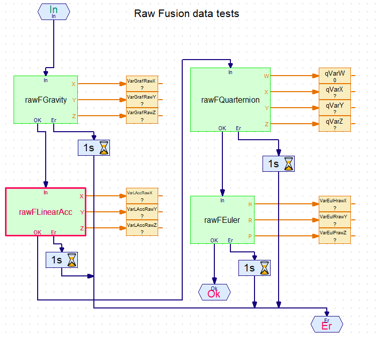

 # TXT Shared Library Interface (SLI) for the BNO055 sensor in RoboPro

Readme about the RoboPro library en examples

# Introduction

The library/examples has been split-up in 3 parts

- Part 0 (map: `0_ProfileCreation_App`) which contains the RoboPro program and library for creates a profile file on the TXT.
  `TxtSliDemoBNO055_SetupProfile.rpp`
  
  Up to **6 different profile files** are possible.
  A profile file contains a complete description of the settings for the BNO055 sensor, the use can set values for:
  
    - Operation mode
 
    -Temperature configuration
 
    - Remapping of the axis
 
    - Calibration (needed in the fusion modes.)
    
    - G-range Accelerometer (see table 3-8 data sheet) (not yet implemented.)
       Needed for the fusion mode.
 
   The profiles are stored on the TXT and need to be loaded by the application 
   
- Part 1 (map: `1_RawMode_BasicUse_Lib`) which contains the RoboPro elements for the raw mode,
    and an example.
    `TxtSliDemoBNO055_Raw_Load_Profile.rpp`
    
- Part 2 (map: `2_FusionMode_BasicUse_Lib`) which contains the RoboPro elements for the fusion mode,
    and an example.
    `TxtSliDemoBNO055_Fusion_Load_Profile.rpp`
    
- Part 4 and 5 
  Some left overs, for what it is.
 

## Requirements
> You need TXT firmware version 4.6.6 or 4.7.0 pre-release

> TXT controller

> (fischertechnik) BNO055 sensor module

> libSliTxtBNO055.so
  needs to be uploaded into the TXT into /opt/knobloch/libs
  
  
## RoboPro library elements

### `init` element
(since 2020-06-02) 
The BNO055 can be used with I2C address x28H (init input 1) or x29H (init input 2). ' 

#### Set up profile (Calibration)  RoboPro application and elements

-main setup
 Here you choose for the operation mode and which profile.

-Device set up 
Here you can fill in some more special settings, like:
remapping
temperature source and units
G-range Accelerometer (see table 3-8 data sheet) (not yet implemented.)

During the execution of this RoboPro program, this section will help you to calibrate the sensor.
When you are following the instruction to move and/or place the sensor, you will see the 4 numbers changing from 0 to 3.
After that the profile file will be saved on the TXT.

#### Test example  RoboPro elements
With these two elements you can see what the basic elements are doing
These elements only run in the fusion operation modes (0x08..0x0C) and need calibration of the model with the sensor.
In your own application, you can use one or more elements to develop your proper algorithm. 

- Raw Fusion Tests RoboPro element

  Main page 

- Converted FusionTests RoboPro element
 
  Main page 

- some output can be used with different output specification: degrees or radian, mm/sec^2 or mg. 
  The data switch helps to change.
   
 
  ## The BNO055 sensor documentation
  - General information about [the BNO055 sensor](https://www.bosch-sensortec.com/bst/products/all_products/bno055).
  [Document overview](https://www.bosch-sensortec.com/products/smart-sensors/bno055.html#documents)
  - For detailed information about the BNO055 sensor see also [the BNO055 data sheet]
  (https://www.bosch-sensortec.com/media/boschsensortec/downloads/datasheets/bst-bno055-ds000.pdf).
  
  ## Introduction in the math behind Quaternions, Euler angle
  About these subject you will find a lot on the internet, there are some very nice YouTube movies, for example:
  - [Quaternions and 3d rotation, explained interactively](https://www.youtube.com/watch?v=zjMuIxRvygQ),
  - [Visualizing quaternions (4d numbers) with stereographic projection](https://www.youtube.com/watch?v=d4EgbgTm0Bg)
  - [Rotation matrix, Quaternion, Euler angles, Rodrigues' rotation explained](https://www.youtube.com/watch?v=DHpBkMAqWOU)
  - [Quaternions Explained Briefly](https://www.youtube.com/watch?v=jlskQDR8-bY)
  - [Quaternions as 4x4 Matrices - Connections to Linear Algebra](https://www.youtube.com/watch?v=3Ki14CsP_9k)
  - [Euler's Formula for the Quaternions](https://www.youtube.com/watch?v=88BA8aO3qXA)

## Operational modes.
The RoboPro supports aims in particular on the next fusion modes:

- 0x08  BNO055_OPERATION_MODE_IMUPLUS       3.3.3.1 IMU            (relative orientation modes)
- 0x0C - BNO055_OPERATION_MODE_NDOF **      3.3.3.5 NDOF           (absolute orientation modes)

 
However there is also basic support for all operation modes. The BNO055 can be use in the next operational modes:

*RAW MODEs*
  	 
	- 0x01  BNO055_OPERATION_MODE_ACCONLY   3.3.2.1 ACCONLY
	- 0x02  BNO055_OPERATION_MODE_MAGONLY   3.3.2.2 MAGONLY
	- 0x03  BNO055_OPERATION_MODE_GYRONLY   3.3.2.3 GYRONLY	
	- 0x04  BNO055_OPERATION_MODE_ACCMAG    3.3.2.4 ACCMAG
	- 0x05  BNO055_OPERATION_MODE_ACCGYRO   3.3.2.4 ACCGYRO
	- 0x06  BNO055_OPERATION_MODE_MAGGYRO   3.3.2.5 MAGGYRO
	- 0x07  BNO055_OPERATION_MODE_AMG       3.3.2.6 AMG (ACC-MAG-GYRO) 
	   
*FUSION OPERATION MODEs*

In most of your application you will use the IMUPLUS or NDOF mode.
      
	- 0x08  BNO055_OPERATION_MODE_IMUPLUS       3.3.3.1 IMU            (relative orientation modes)
	- 0x09  BNO055_OPERATION_MODE_COMPASS       3.3.3.2                (absolute orientation modes)
	- 0x0A - BNO055_OPERATION_MODE_M4G          3.3.3.3 M4G            (relative orientation modes)
    - 0x0B - BNO055_OPERATION_MODE_NDOF_FMC_OFF 3.3.3.4 NDOF_FMC_OFF   (absolute orientation modes)
    - 0x0C - BNO055_OPERATION_MODE_NDOF **      3.3.3.5 NDOF           (absolute orientation modes)
    
IMU =Inertial Measurement Unit.
# document history 
- 2018-11-23 Original CvL
- 2020-06-01 CvL 466.1.2 both, new 
  - version 1.1.1.2 (2018-10-19, under construction)
  - version 1.1.1.4 (2020-06-01, prototype01)
  - version 1.1.1.5 (2020-06-02, prototype02)
    replace the .so
    add a choice for I2C address 1 (x28) or address 2 (x29)

