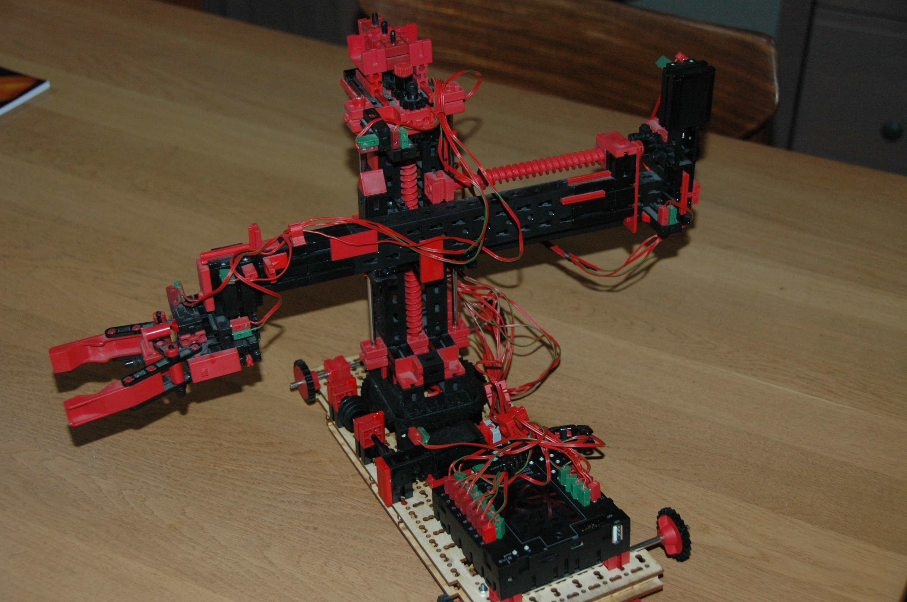

# Example SLI Teachin with read/save
The  SLI offers the possibility to read a set of coordinates from a file N on the Data area and also to write a list of coordinates to a file M on the Data area.

## Can these Data files  be edited manually?
These files can copy with the TXT web interface to your local system, then edit en copy back to the TXT.

##  How to install?
Copy the `libTxtSliSaveTeachIn.so` with the TXT web interface to the TXT `libs` map.
(Or with a SFTP tool like FileZilla.)

## Robopro
Run the TeachIn RoboPro program in the on-line mode.
After opening the program, the you will find some extra buttons and displays on the consol.
- TeachIn.rpp => for robots with switches and motors
- TeachIn_TC-C => for robots with two encoder motors and 2 normal motors+switches.
- TexachIn complete=> Both system and simulation.

## File format
Each line contains a coordinate plus a new line <end off line> 
Format: `x,y,z,r <eol>` 
File name: `Coordinates<Fn>.txt` (Fn >=0)

The coordinates can be edited, inserted new or deleted. 
Don't forget to add a new line to the last coordinate. 
The read will skip empty lines. 
Pay attention to the maximum ranges. The is no control check!

## RoboPro 
.png)
.png) 
.png) 
.png)
.png)

# document history 
- 2020-05-19..24 CvL 466.1.2 new 
- Original from: development project 
  © 2020-04 ing. C.van Leeuwen Btw. Enschede Netherlands
