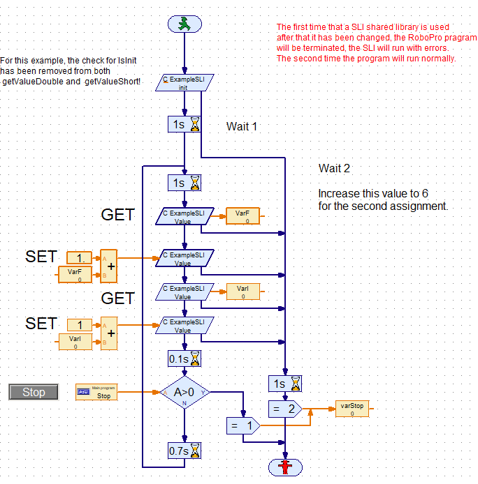
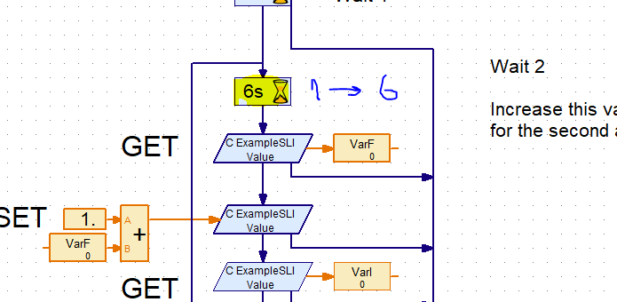

# Content
<!-- TOC depthFrom:1 depthTo:6 withLinks:1 updateOnSave:1 orderedList:0 -->

- [TXT Shared Library Interface (SLI) for ROBOPro](#txt-shared-library-interface-sli-for-robopro)
	- [Assignment 1](#assignment-1)
	- [Assignment 2](#assignment-2)
	- [Assignment 3](#assignment-3)
		- [part A](#part-a)
		- [part B](#part-b)
		- [What have you learn?](#what-have-you-learn)
- [document history](#document-history)

<!-- /TOC --> 
- [Back to the general information](https://github.com/fischertechnik/txt_demo_ROBOPro_SLI/blob/master/README.md)
- [Back to workspace root](../README.md)

# TXT Shared Library Interface (SLI) for ROBOPro
Basic example shows  the principals of the SLI mechanism.
## ROBOPro


The SLI code of the functional elements.

```C
/*!

 * @brief set a global double value in the SLI
 * @param[in] v the value for value_d
 * @return  0: success,continuation by the workflow
 *          Other values error, continuation by the error workflow
 */
int setValueDouble(double v) {
	if (!IsInit) {
		fprintf(stderr, "ExampleSLI:setValueDouble: Not initialized!\n");
		return -1;
	}
	value_d = v;
	printf("****ExampleSLI:setValueDouble: %f\n", v);
	return 0;
}
/*!
 * @brief set a global short value in the SLI
 * @param[in] v the value for value_s
 * @return  0: success,continuation by the workflow
 *          Other values error, continuation by the error workflow
 */
int setValueShort(short v) {
	if (!IsInit) {
		fprintf(stderr, "ExampleSLI:setValueShort: Not initialized!\n");
		return -1;
	}
	value_s = v;
	printf("****ExampleSLI:setValueShort: %i\n", v);
	return 0;
}

/*!
 * @brief get a global double value from the SLI
 * @param[out] v the value of value_d
 * @return  0: success,continuation by the workflow
 *          Other values error, continuation by the error workflow
 */
int getValueDouble(double *v) {
	 if (!IsInit) {
		fprintf(stderr, "ExampleSLI:getValueDouble: Not initialized!\n");
		return -1;
	}
	*v = value_d;
	printf("****ExampleSLI:getValueDouble: %f\n", *v);
	return 0;
}
/*!
 * @brief get a global short value from the SLI
 * @param[out] v the value of value_s
 * @return  0: success,continuation by the workflow
 *          Other values error, continuation by the error workflow
 */
int getValueShort(short *v) {
	if (!IsInit) {
		fprintf(stderr, "ExampleSLI:getValueShort: Not initialized!\n");
		return -1;
	}
	*v = value_s;
	printf("****ExampleSLI:getValueShort: %d\n", *v);
	return 0;
}
```

## Assignment 1 
- Build this project in Eclipse ' Project | Build Project'
- copy the `libExampleSLI.so` from the Release map to the TXT libs map with FileZilla or the [TXT web interface](https://github.com/fischertechnik/txt_demo_ROBOPro_SLI/blob/master/HowToUseTxtWeb.md).
- Start Putty with `screen -r` as console.
- Open with Notepad++ (NPP) the Putty log file.
- Start the RoboPro program in the online mode `LibExample01(SLI).rpp`
- Try to understand wat is happening.
- Press `Stop`
- inspect the log file with NPP.

```C
//code snip
static bool IsInit = false;/*!< Is set by init and reset by stop */
static bool IsStop = true;/*!< Is reset by init and set by stop */
static double value_d=0.0; /*!< Example of a global double variable */
static short value_s=0; /*!< Example of a global short variable */

/*!
 * @brief Can be used to initialize this SLI. <br/>
 *          It is also necessary to check if the SLI has been stopped.
 * @remark The TXT load a SLI lib on the first time that it used.
 * After ending a RoboPro program, the SLI stays in memory. The global values keep their last values.
 * @param[out] t
 * @return  0: success,continuation by the workflow
 *          Other values error, continuation by the error workflow
 */
int init(short *t) {
	if (!IsStop) {
		fprintf(stderr, "****init: was not stopped!\n");
		IsInit = false; 	IsStop = true;
		//set variable and object to their initial value.
	} else {
		printf( "****init: was stopped!\n");
	}

	if (!IsInit) {
		fprintf(stderr, "****init: Not initialized!\n");
		//set variable and object to their start value
		 /*! <value_d = 0.0; */
		value_s = 0;
		IsInit = true;		IsStop = false;
	} else {
		fprintf(stderr, "****init: already initialized!\n");
		return -1;
	}
	return 0;
}
```

## Assignment 2
- Switch now the TXT off and on.
- Start Putty and NPP as in Assignment 1.
- Start en stop after 2 passages of the `1 sec wait` element the RoboPro program `LibExample01(SLI).rpp`.
- Repeat this for a second time.
- Look up in the log file the  two passages of the `init` function.<br/>
  This will look like something like this:
	
```
  SharedLibraryInterface_ExecuteWriteINT16 libExampleSLI.so init -32768
  SharedLibraryInterface_ExecuteReadINT16 lib 0xb3501620
  SharedLibraryInterface_ExecuteReadINT16 func 0xb40498f1
  ****init: xxxxxxxxxxxxxxx!
  ****init: yyyyyyyyyyyyyyy!
  SharedLibraryInterface_ExecuteWriteINT16 libExampleSLI.so init RESULT 0 -32768
```

- Try to describe the differences between the two?
  
## Assignment 3
### part A
Change the value of `Wait 2` from 1 to 6.<br/>

 
  
What is happening in the log?<br/>
This will look like something like this:
```
M:1 1 1 1, I:11 11 11 11 11 11 11 11, c:0 0 0 0
IOs/s DL=72 OL=72, Cam DL=0 OL=0, I2C tr=0 by=0
IOs/s DL=96 OL=96, Cam DL=0 OL=0, I2C tr=0 by=0
IOs/s DL=97 OL=97, Cam DL=0 OL=0, I2C tr=0 by=0
IOs/s DL=99 OL=99, Cam DL=0 OL=0, I2C tr=0 by=0
IOs/s DL=98 OL=98, Cam DL=0 OL=0, I2C tr=0 by=0
ERROR calling read
Closing I2C server connection from 192.168.10.136
I2C Server Thread terminated
IOs/s DL=97 OL=97, Cam DL=0 OL=0, I2C tr=0 by=0
IOs/s DL=97 OL=97, Cam DL=0 OL=0, I2C tr=0 by=0
IOs/s DL=100 OL=100, Cam DL=0 OL=0, I2C tr=0 by=0
```
### part B
Run the `LibExample01(SLI).rpp` in the local mode <br/>
Is the result the same?
  
### What have you learn?
- Building and using a simple SLI.
- How to use the tracing.
- In the online mode there is an `ERROR calling read`, this is a RoboPro issue.<br/>
  The workaround for this problem will be presented in the following project.   

# document history 
- 2020-05-24,28 CvL 466.1.2 new, update