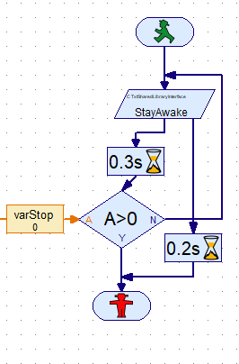
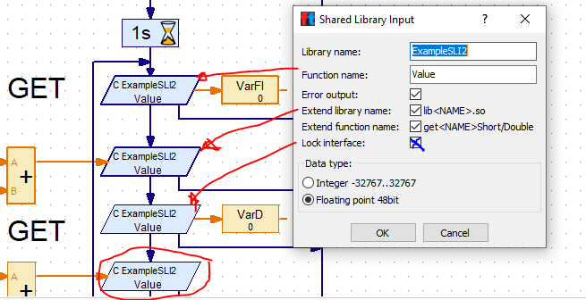

# Content
<!-- TOC depthFrom:1 depthTo:6 withLinks:1 updateOnSave:1 orderedList:0 -->

- [TXT Shared Library Interface (SLI) 2 for ROBOPro](#txt-shared-library-interface-sli-2-for-robopro)
	- [Assignment 1](#assignment-1)
	- [Assignment 2](#assignment-2)
		- [Part A blocking](#part-a-blocking)
		- [Part B `Lock Interface` property](#part-b-lock-interface-property)
	- [What have you learn?](#what-have-you-learn)
- [document history](#history)

<!-- /TOC -->

[Back to workspace root](../README.md)

# TXT Shared Library Interface (SLI) 2 for ROBOPro

Basic example shows:<br/>
- the workaround for the online 5 sec problem.
- the blocking
New almost empty function has been added.<br/>
This function with be called every less then 5 sec.

``` C
int setStayAwakeShort(short t) {
	if (!IsInit) {
		fprintf(stderr, "setStayAwakeShort: Not initialized!\n");
		return -1; //Continue via error work flow
	} else {
		// fprintf( "ExampleSLI:setValueDouble: already initialized!\n");
	}
	return 0;
}
```
And in `LibExample02_A(SLI).rpp`



## Assignment 1 
Use now `libExampleSLI2.so`.<br/>
Repeat [Assignment 3 part A from the `TxtSharedLibraryInterface` project](../TxtSharedLibraryInterface/READ.md).<br/>
Try to explain what is happening?

## Assignment 2
### Part A blocking
- The StayAwake function get it internal sleep function.<br/>
  Remove the comment from:
```C
std::this_thread::sleep_for(std::chrono::milliseconds(t));
```
and compile this project.<br/>
Copy the file `libExampleSLI2.so` to the libs on the TXT.

- Load `LibExample02_B(SLI).rpp` in RoboPro.
  Remember that the first time after replacing a SLI shared library, RoboPro will not run well because it needs to remove the old version from the memory.<br/>
  You need to start `LibExample02_B(SLI)` for a second time.
- What do you happening now?
- The `StayAwake` is blocking the other SLI functions or not?
 
### Part B `Lock Interface` property
Now you will see the roll of the `Lock Interface` property. 
- Look in the RoboPro help for the meaning of the `Lock Interface` property.
- Lock the first 3 `Value` elements in `LibExample02_B(SLI)`. Not the last one!
  
- Start `LibExample02_B(SLI)`
- You will probably see that the four `Value` elements will not wait 3 sec. Only before the start of the first there is a waiting on the `StayAwake`  element.

## What have you learn here?
- The roll of a StayAwake element in the online mode.
- That SLI functions are blocking to each other.
- The roll of `Lock Interface` property.

<a id="history"></a>

# document history 
- 2020-05-24,28 Cvl 466.1.2 new, update