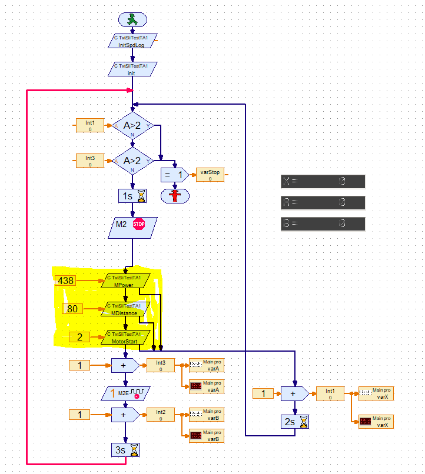
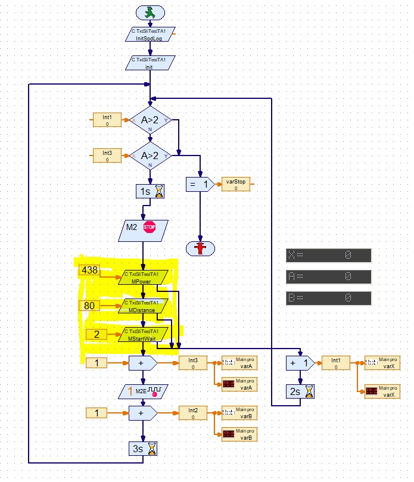

<!-- TOC depthFrom:1 depthTo:6 withLinks:1 updateOnSave:1 orderedList:0 -->

- [TXT Shared Library Interface (SLI) `TxtSliTestTA1` for RoboPro](#txt-shared-library-interface-sli-txtslitestta1-for-robopro)
- [Objective:](#objective)
- [Note](#note)
- [Note SPDlog](#note-spdlog)
- [Functions](#functions)
	- [Overview](#overview)
		- [General](#general)
		- [Spdlog related](#spdlog-related)
	- [TA motor related](#ta-motor-related)
	- [TxtSliTestTA1A](#txtslitestta1a)
		- [init:](#init)
		- [stop:](#stop)
		- [KeepAwake:](#keepawake)
		- [getInitSpdLogShort](#getinitspdlogshort)
		- [getFlushSpdLogShort](#getflushspdlogshort)
		- [(set) MDistance (Short) and   (set) MPower (Short):](#set-mdistance-short-and-set-mpower-short)
		- [(set) MStartWait (Short)](#set-mstartwait-short)
		- [(set) MStart (Short):](#set-mstart-short)
		- [(set) MStop (Short)](#set-mstop-short)
- [The basic C/C++ code](#the-basic-cc-code)
	- [Get the address of the TA](#get-the-address-of-the-ta)
	- [Activate the motor](#activate-the-motor)
	- [Motor is running now](#motor-is-running-now)
		- [End](#end)
	- [RoboPro test programs](#robopro-test-programs)
		- [RoboProTA1A](#roboprota1a)
		- [RoboProTA1B](#roboprota1b)
- [document history](#document-history)

<!-- /TOC -->
# TXT Shared Library Interface (SLI) `TxtSliTestTA1` for RoboPro

# Objective:
To show how the TA can be used to activate a motor or the extended motor

# Note 

> You need TXT firmware version >=4.6.6

> see ROBOPro help  section 8.2.9 and 8.2.10 for the RoboPro  elements
- **Shared Library / C Output**
- **Shared Library / C Input**

# Note SPDlog
[SpdLog](https://github.com/gabime/spdlog/blob/v1.x/README.md) has been added to this SLI.

## Overview of the main C/C++ functions
### Overview
#### General
int init (short *t)   
int setKeepAwakeShort (short t)    
int stop (short *t)

#### Spdlog related
int getInitSpdLogShort (short *t)  
int getDropdLogShort (short *t)  
int getFlushSpdLogShort (short *t)   
int getFlushDropSpdLogShort (short *t)

#### TA motor related   
int setMPowerShort (INT16 power)   
int setMDistanceShort (INT16 distance)   
int setMStartWaitShort (INT16 mId)   
int setMStartShort (INT16 mId)  
int setMStopShort (INT16 v)

## TxtSliTestTA1A  						
Overview of the extended RoboPro functions.
	 									
### init:

    Result:  Set the some general variable.
    Error flow:  in case of an error
    
### stop:

     Result: Reset some general variables.
     Error flow:  in case of an error
     
### KeepAwake:

    Empty dummy function. With calling this function every n<5 sec, RoboPro will not lost connection with the SLI in the on-line mode
    
### getInitSpdLogShort

    Init the spdlog activities.
    
### getFlushSpdLogShort

    flush and terminates the spdlog activities.
      
### (set) MDistance (Short) and   (set) MPower (Short):
    Sets the internal variable MDistance or MPower
    Data input: value for the distance and [1..512] for the power.
    Result: set the values for the extended motor control
    Error flow:  in case of an error
    
### (set) MStartWait (Short)

    Result:  Start the motor and waits until the distance has been reached.  
             Blocking.
    Input: Motor [1, 2, 3, 4]
    Error flow:  in case of an error
    
###  (set) MStart (Short):

    Result: Start the motor.
            Non blocking, the program needs to check later if the distance has been reached.
    Input: Motor [1, 2, 3, 4]
    Result: internal variable resFunc= test01 + value
    Error flow:  in case of an error
    
### (set) MStop (Short)

    Input: Motor [1, 2, 3, 4] <br/>
    Error flow:  in case of an error
    
# The basic C/C++ code

## Get the address of the TA

```C
FISH_X1_TRANSFER *pTArea;
pTArea = GetKeLibTransferAreaMainAddress();
if (pTArea) {   // It's a real pointer  
```
## Activate the motor

```C
  int motorId = mId - 1;  
  // Switch M1 - Encoder Motor on with MSpped and for MDistance  
  // Note: the range of the motor duty cycle values is 0..512  

  // Step 1: Switch Motor on (with a distance from MDistance)  
  pTArea->ftX1out.distance[motorId] =  MDistance  ; // Distance to drive motorId  
  pTArea->ftX1out.motor_ex_cmd_id[motorId]++; // Activate new Distance Value for motorId [0]  
  pTArea->ftX1out.duty[motorId * 2] = MPower; // Switch Motor 1 on with PWM Value MSpeed (= max speed)
  pTArea->ftX1out.duty[motorId * 2 + 1] = 0; // Switch Motor ( O2 [1] ) with minus
  ```
## Motor is running now

```C
  // Wait until the extended motor is ready
  while (**pTArea->ftX1in.motor_ex_cmd_id[motorId] < pTArea->ftX1out.motor_ex_cmd_id[motorId]**) {  
    printf(   "setMotorStartWaitShort:1:OutExCmd: %d  InExCmd: %d  Counter: %d  \n",  
        pTArea->ftX1out.motor_ex_cmd_id[motorId], pTArea->ftX1in.motor_ex_cmd_id[motorId],  
        pTArea->ftX1in.counter[motorId]);  
  };

  printf(
      "setMotorStartWaitShort:2 OutExCmd: %d  InExCmd: %d  Counter: %d  \n",
      pTArea->ftX1out.motor_ex_cmd_id[motorId], pTArea->ftX1in.motor_ex_cmd_id[motorId],
      pTArea->ftX1in.counter[motorId]);
```

### End

```c
} else {
  fprintf(stderr,
      "setMotorStartWaitShort: Error, TA is not available!\n");
  return -1;
}

```


## RoboPro test programs
### RoboProTA1A
The use of the non-blocking function.  
`varA`  is direct after the function and `varB` is after the RoboPro element that waits until the extended motor is ready.  
In this eample the `varB` is later then `varA`

### RoboProTA1B
The use of the blocking function.  
In this example the `varB` is on the same moment as `varA`, after the motor has stopped.



# document history 
- 2020-05-28 CvL 466.1.1 new<br/>
- Original from: on-line training SLI-programming part 2<br/>
  © 2020-04 ing. C.van Leeuwen Btw. Enschede Netherlands