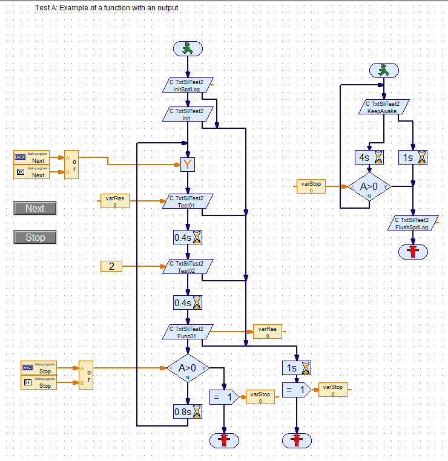

<!-- TOC depthFrom:1 depthTo:6 withLinks:1 updateOnSave:1 orderedList:0 -->

- [TXT Shared Library Interface (SLI) `TxtSliTest2` for ROBOPro](#txt-shared-library-interface-sli-txtslitest2-for-robopro)
	- [Note](#note)
	- [Note SPDlog](#note-spdlog)
	- [TxtSliTest2](#txtslitest2)
	- [Overview of the extended RoboPro functions](#overview-of-the-extended-robopro-functions)
		- [init:](#init)
		- [stop:](#stop)
		- [KeepAwake:](#keepawake)
		- [getInitSpdLogShort](#getinitspdlogshort)
		- [getFlushSpdLogShort](#getflushspdlogshort)
		- [getFlushDropSpdLogShort](#getflushdropspdlogshort)
		- [getDropSpdLogShort](#getdropspdlogshort)
		- [(set) Test01 (Short) and   (set) Test02 (Short):](#set-test01-short-and-set-test02-short)
		- [(get) Func01 (Short)](#get-func01-short)
		- [(set) Func02 (Short):](#set-func02-short)
		- [(get) RetValue02 (Short):](#get-retvalue02-short)
	- [RoboPro test programs](#robopro-test-programs)
		- [TxtSliTest2A](#txtslitest2a)
- [Suggestions for experiments](#suggestions-for-experiments)
- [document history](#document-history)

<!-- /TOC -->
# TXT Shared Library Interface (SLI) `TxtSliTest2` for ROBOPro

## Note 
> You need TXT firmware version >=4.6.6  
> 
> see ROBOPro help  section 8.2.9 and 8.2.10 for the RoboPro  elements
- **Shared Library / C Output**
- **Shared Library / C Input**

## Note SPDlog
[SpdLog](https://github.com/gabime/spdlog/blob/v1.x/README.md) has been added to this SLI.  


## TxtSliTest2
The TxtSliTest2 is as far as the functionality the same as .
However the functionality has been moved from the main program file into the supporting class.
     						
## Overview of the extended RoboPro functions

int init (short *t)  
int setKeepAwakeShort (short t)   
int stop (short *t)   
int getInitSpdLogShort (short *t)    
int getDropdLogShort (short *t)   
int getFlushSpdLogShort (short *t)   
int getFlushDropSpdLogShort (short *t)   
int setTest01Short (short n)   
int setTest02Short (short n)   
int getFunc01Short (short *resultV)  
int setFunc02Short (short inputV)   
int getRetValue02Short (short *t)
										
### init:
Result:  Set the some general variable.  
Error flow:  in case of an error

### stop:
Result: Reset some general variables.  
Error flow:  in case of an error

### KeepAwake:
    Empty dummy function.
    With calling this function every n<5 sec, RoboPro will not lost connection with the SLI in the on-line mode
    
### getInitSpdLogShort
    Init the spdlog activities.
    
### getFlushSpdLogShort
    flush  the spdlog activities.
    
### getFlushDropSpdLogShort
    flush  and terminates the spdlog activities.
    
### getDropSpdLogShort
    terminates the spdlog activities.  
        
### (set) Test01 (Short) and   (set) Test02 (Short):
    Data input: integer value
    Result: set general variable test01 or test02 to value
    Error flow:  in case of an error
    
### (get) Func01 (Short)
    Result: calculates test01 + test02
    Output: integer test01 + test02
    Error flow:  in case of an error
    
###  (set) Func02 (Short):
    Input: integer value
    Result: internal variable resFunc= test01 + value
    Error flow:  in case of an error
    
### (get) RetValue02 (Short):
    Output: integer resFunc
    Error flow:  in case of an error
## RoboPro test programs

### TxtSliTest2A

Example of the use of ```spdlog```

Can also use in the off-line mode, their is a button on the screen.


# Suggestions for experiments

# document history 
- 2020-05-28 CvL 466.1.1 new<br/>
- Original from: on-line training SLI-programming part 2<br/>
  © 2020-04 ing. C.van Leeuwen Btw. Enschede Netherlands
