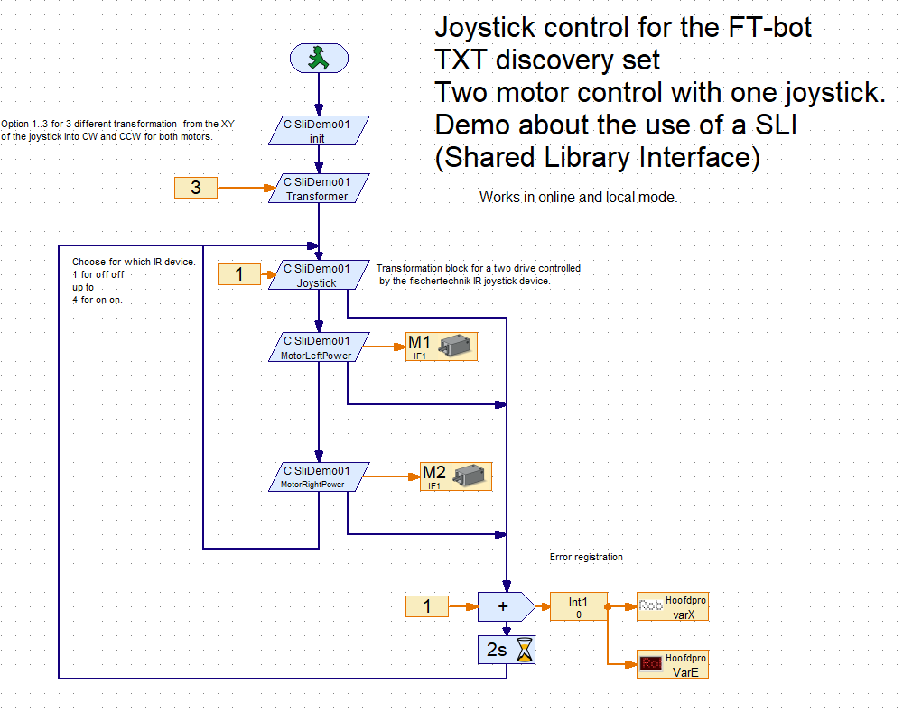

# TXT Shared Library Interface (SLI) Demo01 for ROBOPro

This demo shows how to use the incoming  TA-IR data from the IR-JoyStick in a SLI.
The left Joystick is use to calculate the motor powers for a two wheel drive FT-Bot. For example the TXT-discovery set.
Joystick up: is more forwards speed; down is backwards speed. Joystick left/right makes the FT-bot turns or even rotated.
To have more control over the model, the power is corrected to avoid too less power.

Basic information about the SLI can be found in the TxtSharedLibraryInterface, the starting example.

> You need TXT firmware version >=4.4.3

> see ROBOPro help in section 8.2.9 and 8.2.10

In this library are two main RoboPro element available
> The RoboPro element "Joystick".
  This element takes as input which joystick and calculates  the power for the left and right motor.
  These results are available by two other RoboPro elements.
  This functionality will runs in both online and local mode.
  See RoboPro example code: TxtSliDemo01_A.rpp with extra debug data.
                            TxtSliDemo01_AA.rpp.

 
> The RoboPro element "JoystickMotors" 
  Is an extended version of the RoboPro element "Joystick".
  The left and right moter are powered directly.
  This functionality will only runs in the local mode.
  See RoboPro example code: TxtSliDemo01_B.rpp with extra debug data.
                            TxtSliDemo01_BB.rpp.
							
							
										
## (set) Joystick:
   Result:  Set the values for MotorLeftPower and MotorRightPower.
   Input: the id for the fischertechnik IR-controller
          1: both switches off
          2: switch 1 on,  switch 2 off
		  3: switch 1 off, switch 2 on
		  4: both switches on
   Error flow in case of an error or wrong value for the IR-controller ID
### (set) Transformer:
     choice for the algoritme for the behavior of the X_Y-joystick to left/right motor power.  
     [1..3]
     0 is liniar
     1 elimination of offset 0..10%, 10%.. 100% log-function.
     2 elimination of offset 0..5%, 5%.. 100% log-function
     3 liniar with an offset of 0..45%	 
### (get) MotorLeftPower and  (get) MotorRightPower:
    get the calculated value for the motor power.
    [-512..0..512]
	Note: Use this in combination with the RoboPro element MotorOutput.
    Note: the property resolution of the element MotorOutput needs to configure for 512 steps 

## JoystickMotors
   Result: The new values are sent to both the Motors and set also the values for MotorLeftPower and MotorRightPower.
   Input: the id for the fischertechnik IR-controller
          1: both switches off
          2: switch 1 on,  switch 2 off
		  3: switch 1 off, switch 2 on
		  4: both switches on
   Error flow in case of an error or wrong value for the IR-controller ID
###  (set) MotorIdLeft and (set) MotorIdLeft:
     Set which motor is in use as right and which one as left motor.
     Default: Left =1 (M1) and Right = 2 (M2).	 
### (set) Transformer:
     choice for the algoritme for the behavior of the X_Y-joystick to left/right motor power.  
     [1..3]
     0 is liniar
     1 elimination of offset 0..10%, 10%.. 100% log-function.
     2 elimination of offset 0..5%, 5%.. 100% log-function
     3 liniar with an offset of 0..45%	 
### (get) MotorLeftPower and  (get) MotorLeftPower:
     get the calculated value for the motor power.
     [-512..0..512]
	 Note: this elements can for example used for printing the actual power.
    

## Shared Library in C / C++

